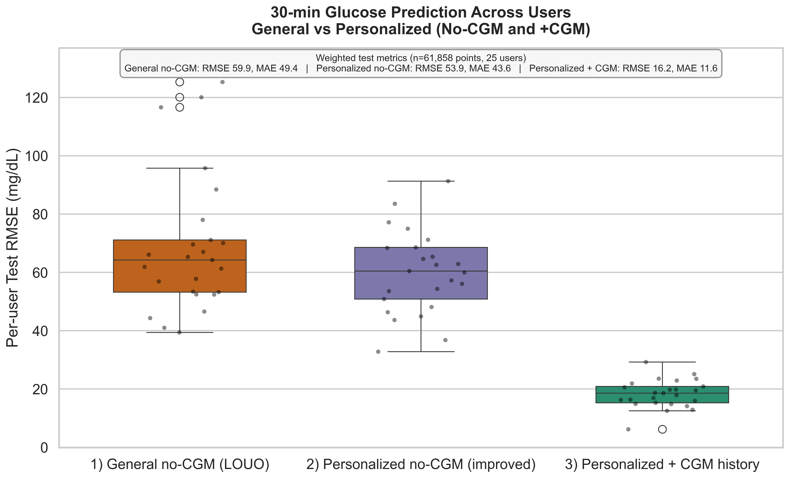

# CGM-Optional Glucose Forecasting

**Can wearable signals and self-logged health data support a 30-minute glucose forecast when continuous glucose monitor (CGM) data is unavailable at prediction time?**

This March 2026 research prototype evaluates that question with a user-held-out study of 25 people. It treats the task as a forecasting problem, compares population and personalized models, and documents the performance gap between wearable-only inputs and a model that can also use recent CGM history.

> **Research prototype only.** This work does not provide medical advice, clinical validation, or a safety layer for healthcare use.



## The question

CGM devices provide high-frequency glucose measurements, but they can be costly, inconsistently worn, or unavailable. This project asks two practical questions:

1. Can a model forecast glucose 30 minutes ahead from wearable and self-logged signals alone?
2. Does training on a person’s own history improve on a general, user-held-out model?

## Study design

| Item | Design |
| --- | --- |
| Participants | 25 people |
| Sampling | 5-minute intervals |
| Target | CGM glucose 30 minutes in the future |
| Test set | 61,858 observations across all users |
| Inputs | Heart rate, steps, calories, time, carbohydrate logs, and basal/bolus insulin logs |
| Evaluation | Strict chronological split: first 80% of each user for training and final 20% for testing |

Feature construction uses lagged and rolling wearable/event signals, with `shift(1)` applied to rolling features to ensure the model only sees information available at the prediction time.

## Main results

Lower error is better. Values below are weighted across the 25 users.

| Model setup | Inputs available at prediction | RMSE (mg/dL) | MAE (mg/dL) |
| --- | --- | ---: | ---: |
| General no-CGM | Other users’ data; wearable and self-logged signals | 59.9 | 49.4 |
| Personalized no-CGM | Adds the target user’s earlier data; no CGM input | 53.9 | 43.6 |
| Personalized with CGM history | Personalized model plus recent CGM values | 16.2 | 11.6 |

Personalization improved wearable-only RMSE by about 10% relative to the general model, but wearable-only predictions still varied widely across users. Recent CGM history carried substantially more predictive signal. The result supports a cautious interpretation: personalization helps, but wearable inputs alone were not reliable enough in this study for precise glucose estimation.

An additional personalized no-CGM algorithm sweep compared ridge, elastic net, histogram gradient boosting, and extra trees. Extra trees produced the lowest weighted RMSE in that sweep (53.11 mg/dL), narrowly ahead of ridge (53.65 mg/dL). See [the analysis note](ALGO_SWEEP_NOTES.md) and [result table](results/tables/personalized_no_cgm_algorithm_sweep.csv).

## Repository guide

```text
.
├── notebooks/       Main exploratory analysis and three-model comparison
├── src/             Re-runnable no-CGM algorithm-sweep scripts
├── results/         Figures and tables produced during analysis
├── docs/            March 2026 symposium presentation
├── data/            Local dataset location; excluded from Git
├── references/      Local research papers; excluded from Git
└── archive/         Superseded notebook backup; excluded from Git
```

## Reproduce the analysis

1. Create an environment with the packages in `requirements.txt`.
2. Obtain the source data yourself and place preprocessed participant CSV files in `data/HUPA-UCM Diabetes Dataset/Preprocessed/`. See [data/README.md](data/README.md).
3. Run the notebook from the repository root:

   ```bash
   jupyter notebook notebooks/glucose_forecasting_30m.ipynb
   ```

4. To repeat the quick personalized no-CGM sweep:

   ```bash
   python src/algorithm_sweep_no_cgm_30m_quick.py
   ```

The dataset, papers, and archived backup are deliberately excluded from version control. They may carry data-use, privacy, or redistribution restrictions.

## Limitations and next steps

- Retrospective data only, with no prospective clinical validation.
- Wearable and self-logged event timing may introduce error.
- Important signals such as stress, hormones, sleep quality, and long-term individual drift were not modeled.
- Future work could add sleep/HRV and exercise-intensity features, test longer CGM-off intervals, and evaluate calibrated uncertainty before considering any clinical use.

## Materials

- [March 2026 symposium deck](docs/presentation/glucose_wearables_symposium_deck_march_2026.pptx)
- [Primary notebook](notebooks/glucose_forecasting_30m.ipynb)
- [Algorithm sweep note](ALGO_SWEEP_NOTES.md)
